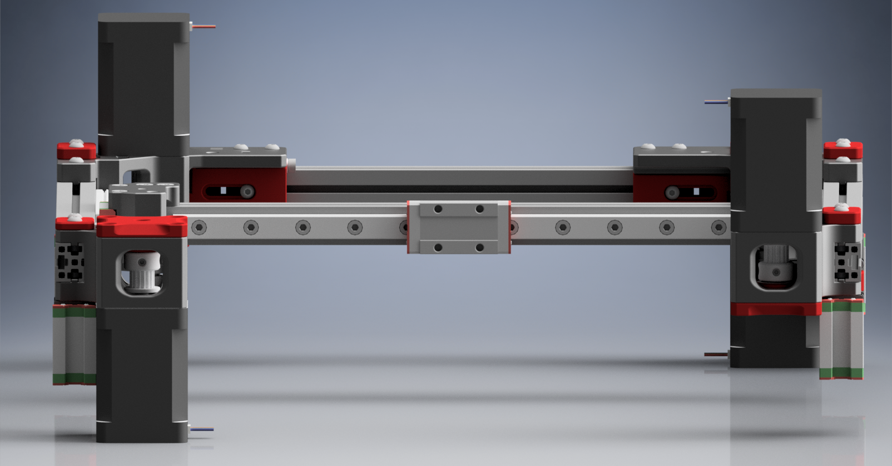

[![CC BY-NC-SA 4.0][cc-by-nc-sa-shield]][cc-by-nc-sa]

# Micron+ AWD Minilith gantry
> [!IMPORTANT]
> **All props goes to CloakedWayne, I didn't do anything except adapt the monolith gantry to fit PFA specs.**
> 
> Don't expect a step-by-step build guide. Everything is really tight and needs a well tuned printer.
> I won't be updating this gantry or make a 2WD version. Now that Monolith RC1 is out I wan't to work towards
> something more similar to that.
>
> The belt path is the same as the Monolith gantry.
>
> For the toothed idlers, they have to be 12.7mm OD!!! My build is based off the Formbot kit and they are the right size.

## Drive configurations:
there is only an AWD 6mm belt configuration as of now.

## Toolheads
Since this gantry has reversed belts, I kept Monoliths belt spacing for better toolhead support.
Any toolhead with a dedicated Monolith MGN9H carriage should fit on this gantry. 

## Futur Plans
- Update to RC1 Monolith
- 2WD version
- PFA belt spacing for better fitment (so custom toolhead mounts)
- Fix the random hights on the parts.
- Sheet metal version
- Potentially a Salad fork version 

## Downsides
- Z-chain relocation or Z-umbilical is needed
- loss of X travel depending on the toolhead
- Small build volume loss on the front corners. (worse if you use klicky probe)
- A lot louder than 2WD.

## Acknowledgement
I want to thank:
- **CloakedWayne** I can't state this enough, all props goes to CloakedWayne, he designed and put all the effort in designing this gantry.
- **Hartk** For making the incredible Micron and starting me out in a spiral downhill of Vorons / DIY 3D printers. 

> [!NOTE]
> **If some things aren't clear, consider joining the Monolith Discord.**
> **I have a user project in the server where you can ask questions!**
> **Maybe other users might be able to help you seeing as functionnality and belt path is basically the same**
>
> 
>
> **If you would like to support this project, please consider supporting CloakedWayne on Ko-fi not me.**
> **he did all the heavy lifting in creating this beautiful gantry !**

    
This work is licensed under a
[Creative Commons Attribution-NonCommercial-ShareAlike 4.0 International License][cc-by-nc-sa].

[![CC BY-NC-SA 4.0][cc-by-nc-sa-image]][cc-by-nc-sa]

[cc-by-nc-sa]: http://creativecommons.org/licenses/by-nc-sa/4.0/
[cc-by-nc-sa-image]: https://licensebuttons.net/l/by-nc-sa/4.0/88x31.png
[cc-by-nc-sa-shield]: https://img.shields.io/badge/License-CC%20BY--NC--SA%204.0-lightgrey.svg
